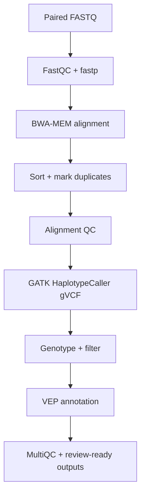

# Reproducible Germline Short-Variant Pipeline

[](https://github.com/Delaram-Genomics/NGS-Germline-Pipeline/actions/workflows/ci.yml)

An educational, portfolio-grade workflow for paired-end Illumina germline
whole-exome sequencing (WES). The project follows a sample from FASTQ quality
control to an annotated, prioritisation-ready VCF while recording the evidence
needed to review each analytical stage.

> [!IMPORTANT]
> This repository is for training and research. It is **not** a validated
> medical device, accredited diagnostic pipeline, or substitute for review by
> qualified clinical scientists.

## Version 1 scope

| Included | Not yet included |
| --- | --- |
| Paired-end Illumina WES | Clinical reporting or automated ACMG classification |
| Human GRCh38 reference | Copy-number and structural-variant calling |
| Germline SNVs and small indels | Trio or cohort joint genotyping |
| FASTQ, alignment and variant QC | Production deployment with patient data |
| Functional annotation with VEP | Formal analytical or clinical validation |

The narrow scope is deliberate: a small, tested workflow is more credible than
a broad workflow whose claims cannot be demonstrated.

## Current verification status

The implementation and automated test suite pass locally. A real Nextflow run
completed through variant calling on the deterministic non-human fixture and
recovered its single introduced heterozygous SNV. Public GIAB HG002 accuracy
benchmarking remains pending; no precision, recall or production-readiness
claim is made. See [`docs/SMOKE_TEST_REPORT.md`](docs/SMOKE_TEST_REPORT.md),
[`docs/PROJECT_STATUS.md`](docs/PROJECT_STATUS.md) and
[`CHANGELOG.md`](CHANGELOG.md).

## Planned analysis



The implementation is being developed in milestones. See
[`docs/ROADMAP.md`](docs/ROADMAP.md) for the eight-week delivery plan and
[`docs/QUALITY_AND_LIMITATIONS.md`](docs/QUALITY_AND_LIMITATIONS.md) for the
quality model and safe-use boundaries.

## Repository layout

```text
config/        Example configuration and samplesheet
docs/          Scientific rationale, quality criteria and project evidence
scripts/       Command-line pipeline components and input validation
tests/         Automated tests that do not require genomic reference data
results/       Local outputs (large genomic files are ignored by Git)
```

## Quick start: validate inputs

This first milestone validates sample metadata and FASTQ pairing before any
compute-intensive analysis is attempted.

```bash
cp config/samplesheet.example.csv samplesheet.csv
python3 scripts/validate_inputs.py --samplesheet samplesheet.csv
```

For a real run, replace the example paths with absolute or samplesheet-relative
paths to your own gzipped FASTQ files. Patient-identifiable filenames and data
must never be committed to this public repository.

## Raw-read QC

After validation, preview the complete FastQC, fastp and MultiQC stage:

```bash
scripts/run_qc.sh \
  --samplesheet samplesheet.csv \
  --outdir qc \
  --threads 4 \
  --dry-run
```

Remove `--dry-run` when the Conda environment is active and the input paths are
correct. The main review output is `qc/multiqc/multiqc_report.html`. See
[`docs/FASTQC.md`](docs/FASTQC.md) for an interpretation guide.

## Alignment and BAM processing

After QC review, preview alignment to an indexed GRCh38 reference:

```bash
scripts/run_alignment.sh \
  --samplesheet samplesheet.csv \
  --reference /path/to/GRCh38.fa \
  --reads-dir qc/trimmed_fastq \
  --outdir results/alignment \
  --threads 4 \
  --dry-run
```

The stage adds read groups, performs mate-tag calculation, coordinate sorting,
duplicate marking, BAM validation/indexing and alignment metrics. See
[`docs/ALIGNMENT_QC.md`](docs/ALIGNMENT_QC.md).

## Germline short-variant calling

The next stage calls per-sample gVCFs with GATK HaplotypeCaller, genotypes the
sample, applies documented SNP/indel filter labels and normalises variants:

```bash
scripts/run_variant_calling.sh \
  --samplesheet samplesheet.csv \
  --reference /path/to/GRCh38.fa \
  --intervals /path/to/exome_targets.interval_list \
  --dry-run
```

See [`docs/variant_calling.md`](docs/variant_calling.md). Only approved public,
broadly consented or synthetic data may be used; see
[`docs/DATA_GOVERNANCE.md`](docs/DATA_GOVERNANCE.md).

## Annotation and research review

VEP runs offline with an explicit cache release and produces an annotated VCF,
HTML summary and transparent non-clinical review table:

```bash
scripts/run_annotation.sh \
  --samplesheet samplesheet.csv \
  --reference /path/to/GRCh38.fa \
  --vep-cache-dir /path/to/vep_cache \
  --vep-cache-version 113 \
  --dry-run
```

The cache version is an example and must match the installed resource. See
[`docs/variant_annotation.md`](docs/variant_annotation.md).

## One-command Nextflow execution

The four stages are connected by [`main.nf`](main.nf). A full local run uses:

```bash
nextflow run main.nf \
  -profile conda \
  --samplesheet samplesheet.csv \
  --reference /path/to/GRCh38.fa \
  --intervals /path/to/exome_targets.interval_list \
  --vep_cache_dir /path/to/vep_cache \
  --vep_cache_version 113 \
  --outdir results
```

Add `-resume` to the same command after an interruption. Installation and
beginner troubleshooting are documented in
[`docs/installation.md`](docs/installation.md); orchestration details are in
[`docs/Workflow.md`](docs/Workflow.md).

## Smoke test and accuracy benchmark

A deterministic non-human fixture checks workflow wiring. Analytical accuracy
is evaluated separately with public GIAB HG002 data and `hap.py` inside matching
benchmark regions:

```bash
scripts/prepare_smoke_test.sh --outdir test_data/smoke
scripts/run_benchmark.sh --help
```

See [`docs/BENCHMARKING.md`](docs/BENCHMARKING.md) and the completed
[`docs/SMOKE_TEST_REPORT.md`](docs/SMOKE_TEST_REPORT.md). No analytical
performance claim is made until a real, versioned benchmark has completed.

## Portfolio and interview use

Evidence-based CV wording and interview explanations are maintained in
[`docs/PORTFOLIO.md`](docs/PORTFOLIO.md) and
[`docs/INTERVIEW_GUIDE.md`](docs/INTERVIEW_GUIDE.md). These documents distinguish
implemented work from pending runtime and benchmark evidence.

## Development checks

```bash
python3 -m unittest discover -s tests -v
python3 -m py_compile scripts/validate_inputs.py
bash -n scripts/*.sh scripts/lib/*.sh
```

## Reproducibility principles

- Validate sample identifiers, read pairing and file readability before work.
- Keep reference build and resource versions explicit.
- Record commands, software versions, parameters and checksums.
- Fail early on missing or ambiguous inputs.
- Preserve intermediate QC evidence rather than reporting only final variants.
- Separate technical filtering from expert clinical interpretation.

## Author

Delaram Sherkatghannad

MSc Human and Molecular Genetics, University of Sheffield

## Licence

[MIT](LICENSE)
