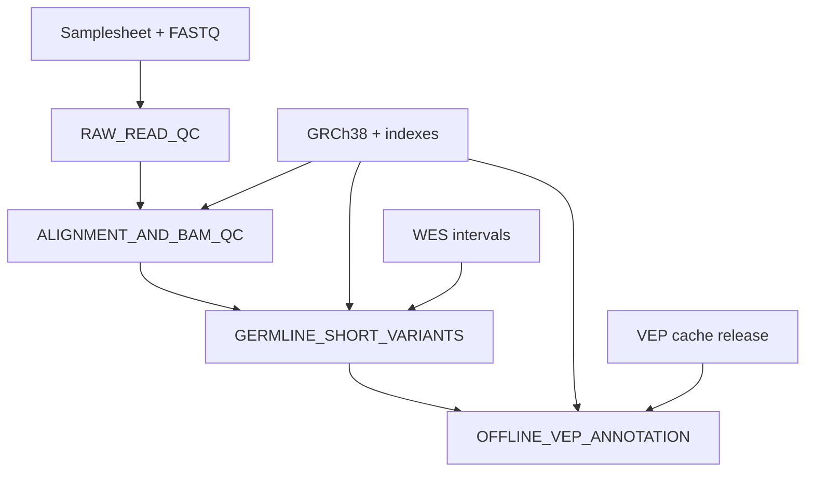

# Nextflow workflow

## Why orchestration is needed

The Bash scripts make each analytical stage readable, but a complete pipeline
also needs dependency tracking, restartability, resource control and execution
metadata. Nextflow DSL2 provides that orchestration while retaining the scripts
as auditable stage implementations.

## Dependency graph

## Processes

| Nextflow process | Stage script | Principal output |
| --- | --- | --- |
| `RAW_READ_QC` | `scripts/run_qc.sh` | FastQC, fastp and MultiQC evidence |
| `ALIGNMENT_AND_BAM_QC` | `scripts/run_alignment.sh` | Mark-duplicate BAM and mapping metrics |
| `GERMLINE_SHORT_VARIANTS` | `scripts/run_variant_calling.sh` | gVCF and normalised filtered VCF |
| `OFFLINE_VEP_ANNOTATION` | `scripts/run_annotation.sh` | Annotated VCF and research-review TSV |

## Restartability

Nextflow stores task state under `work/`. Re-running an unchanged command with
`-resume` can reuse successful tasks. The published `results/` directory is not
the cache and should not be used as a substitute for `work/`.

Do not manually edit files inside `work/`. If a result is wrong, identify the
input, parameter, resource or code change and rerun through Nextflow.

## Profiles

- `conda`: creates/uses the repository software environment for processes.
- `test`: reduces requested resources and skips annotation; it does not yet
  supply a bundled test dataset.

The initial implementation targets a local Ubuntu/WSL executor. HPC, Docker and
cloud profiles require separate testing before they are advertised.

## Provenance

Every run generates:

- `execution_report.html` for runtime and resource use;
- `execution_trace.txt` for per-task metadata;
- `timeline.html` for task timing;
- `workflow_dag.html` for the executed graph;
- stage-specific tool and reference provenance files.

These records support reproducibility but do not replace validation or a
laboratory quality-management system.

## Current granularity limitation

Version 0.1 orchestrates each analytical stage across the samplesheet as one
task. This is suitable for a small portfolio demonstration. A later refactor
will create per-sample channels so samples can run and resume independently on
larger cohorts.
